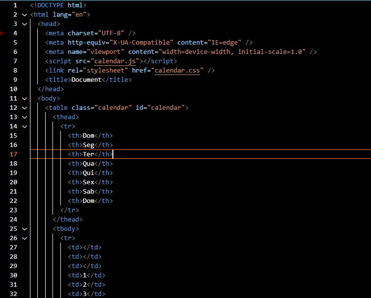
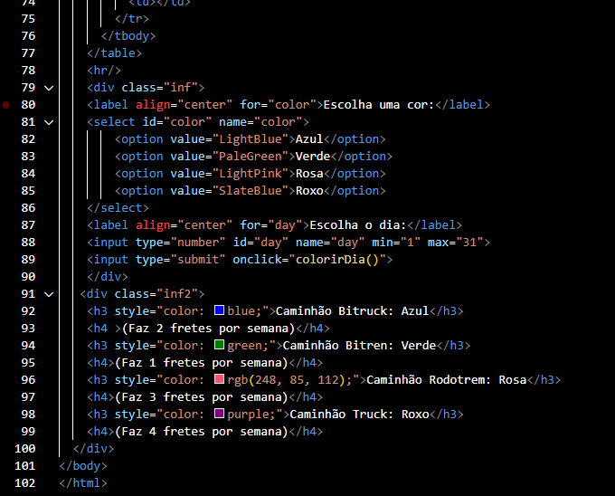
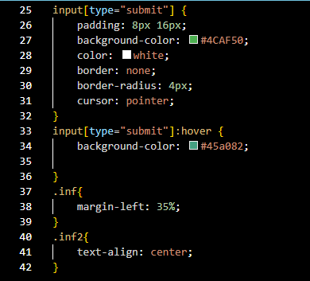
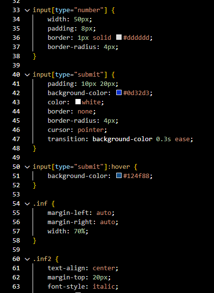
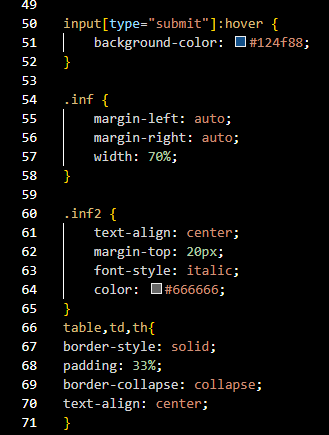
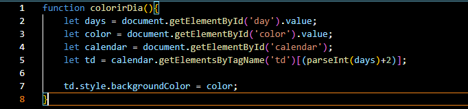
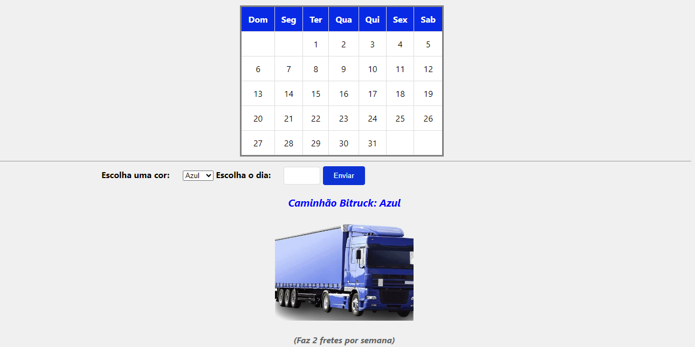

# README

Este é um exemplo de README para explicar um projeto web que inclui um calendário interativo e estilos CSS.

## Estrutura do Projeto

O projeto consiste em três arquivos principais:

1. `index.html`: Este é o arquivo HTML principal que contém a estrutura básica da página web, incluindo o calendário e o formulário para selecionar uma cor e um dia para colorir no calendário.

2. `calendar.css`: Este é o arquivo CSS que define os estilos para a página web, incluindo estilos para o calendário, os elementos de formulário e as divisões.

3. `calendar.js`: Este é o arquivo JavaScript que contém a lógica para colorir o dia selecionado no calendário com a cor escolhida pelo usuário.

## HTML (index.html)

O arquivo HTML contém a estrutura básica da página web, incluindo:

- Declaração do tipo de documento (`<!DOCTYPE html>`).
- Definição do idioma (`<html lang="en">`).
- Inclusão de metadados, como codificação de caracteres e configuração da viewport.
- Inclusão de links para o arquivo de estilos CSS e script JavaScript.
- Uma tabela (`<table>`) para exibir o calendário.
- Um formulário para selecionar uma cor e um dia para colorir no calendário.
- Informações sobre diferentes tipos de caminhões.

## CSS (calendar.css)

O arquivo CSS define os estilos para os elementos na página web, incluindo:

- Estilos para o corpo da página, a tabela do calendário e os elementos de formulário.
- Cores de fundo, bordas, alinhamento de texto e margens para os elementos.

## JavaScript (calendar.js)

O arquivo JavaScript contém a função `colorirDia()` que é chamada quando o usuário clica no botão de envio no formulário. Esta função obtém o dia e a cor selecionados pelo usuário e colore o dia correspondente na tabela do calendário.

---

Este README fornece uma visão geral do projeto e explica a estrutura do código HTML, CSS e JavaScript.

# Funcionalidades do Calendário:
Representação dos Veículos:

Os quatro veículos serão representados por cores diferentes no calendário. 

Por exemplo, um caminhão pode ser azul, outro verde, outro rosa e outro roxo.

# Agendamento dos Fretes:

Cada dia do calendário representará um dia do mês.

Os dias em que um veículo já tem um frete agendado serão coloridos com a cor correspondente a esse veículo.

Se um veículo já realizou três fretes no mês, os dias restantes do mês para esse veículo não estarão disponíveis para agendamento.

# Regras de Agendamento:

Um veículo não pode fazer mais de um frete no mesmo dia. 

Portanto, cada dia do calendário só pode ser agendado por um único veículo.
Cada veículo pode realizar até três fretes por mês. 

Assim, uma vez que um veículo tenha feito três fretes, os dias restantes do mês para esse veículo não estarão disponíveis para agendamento.

# Implementação:

O JavaScript será responsável por controlar as interações do usuário com o calendário.

Quando o usuário seleciona um dia e uma cor (representando um veículo) para agendar um frete, o JavaScript verifica se o veículo já realizou três fretes no mês.

Se o veículo ainda tiver fretes disponíveis, o JavaScript verifica se o dia selecionado está disponível para agendamento (ou seja, se o dia já não está agendado por outro veículo).

Se o dia estiver disponível, o JavaScript colore o dia com a cor do veículo selecionado e registra o agendamento.

Se o veículo já realizou três fretes ou o dia já está agendado, uma mensagem de erro é exibida ao usuário, informando que o agendamento não é possível.

# Benefícios:

O calendário oferece uma visualização clara dos dias disponíveis para agendamento de fretes.

As cores dos veículos facilitam a identificação e a organização dos agendamentos.

As regras de agendamento garantem uma distribuição equitativa dos fretes entre os veículos e evitam conflitos de agendamento.

Com essa implementação, a equipe de agendamento da empresa Alpha terá uma ferramenta eficaz para gerenciar os agendamentos de fretes de forma organizada e eficiente.

# Autor 
* Geovana Aparecida de Lima

